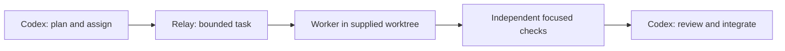

# Codex Relay

Give Codex a bounded coding task to hand off, and a result you can review.

Relay is a small Rust CLI and local MCP server. Your Codex coordinator assigns a named worker profile, supplies an isolated worktree and sets the limits. Relay records progress, runs the assigned checks and returns changed paths, hashes and blockers. You keep planning, review and integration in Codex.

**Current status: experimental core.** Lifecycle and MCP tests pass; live provider execution remains unverified. The Docker boundary passes synthetic containment and HTTPS checks on a macOS host with a Linux daemon; the CLI also passes Linux ARM64 checks. The native macOS probe fails because session detachment succeeds, and Muse authentication still needs a safe handoff. There are no published releases. Check the [release status](docs/release.md) before distributing it.

[Quick start](#quick-start) · [CLI conventions](docs/cli.md) · [MCP setup](docs/mcp.md) · [Security](docs/security.md)

## The workflow



You give a worker explicit writable paths, acceptance criteria and test arguments. Begin with one worker. Relay reserves ownership across worktrees in the same repository, accounts for the coordinator's fresh native-worker count and permits one correction. Codex reviews the files and runs the full project gate after integration.

| Tested core | Prepared, blocked or untested |
| --- | --- |
| CLI and six stdio MCP tools | Live Muse and Aider execution |
| Durable jobs, cancellation and descendant cleanup | Safe Muse subscription authentication |
| Scope checks, time/output limits and one correction | Upstream provider/model route receipts |
| Built-in simulation and installed-binary smoke | Live harness images and provider credentials |
| Docker containment and restricted HTTPS synthetic checks | Independent security review and hosted CI |

## Quick start

Use a source checkout with Rust **1.97+**, Git, Python **3.9+** and [RTK](https://github.com/rtk-ai/rtk#installation). CLI builds and installed MCP smoke tests pass on Apple Silicon macOS and Linux ARM64 in an isolated container. Native Linux hosts and x86-64 remain untested locally; the hosted macOS/Linux CI matrix is prepared. Relay finds RTK in the Homebrew/system locations `/opt/homebrew/bin`, `/usr/local/bin` or `/usr/bin`. Workers use a separately reviewed local Docker runtime; see [runtime setup](docs/runtime.md).

```sh
rtk proxy cargo build --release --locked
rtk proxy python3 scripts/install.py --prefix "$HOME/.local"
rtk proxy "$HOME/.local/bin/codex-relay" init --managed-root "$HOME/.codex/worktrees"
rtk proxy "$HOME/.local/bin/codex-relay" doctor --json
```

Choose the managed root that matches your Codex installation. `init` creates a configuration with **no worker profiles**, and refuses to overwrite an existing file. On macOS, the default configuration lives at `~/Library/Application Support/codex-relay/config.json`, with state beside it in `state/`. [CLI conventions](docs/cli.md) document overrides and platform locations.

`doctor` reports installed tools and declared capabilities. A successful response does not establish isolation, authentication or provider readiness. Try the installed binary without a provider account:

```sh
rtk proxy python3 scripts/smoke.py --binary "$HOME/.local/bin/codex-relay"
```

The smoke test creates a disposable repository and configuration, drives all six MCP tools and edits a synthetic text file through the built-in simulator. It uses no network or credentials. It does not establish live-worker support.

## Profiles and MCP

Profiles separate the coding harness from the inference provider and model. An excerpt from the full [disabled Muse example](examples/muse-profile.json):

```json
{
  "enabled": false,
  "harness": "muse",
  "provider": "meta",
  "model": "muse-spark-1.3",
  "credential_env": [],
  "network_hosts": []
}
```

Keep it disabled. The example prepares a reviewed setup; it is not a runnable subscription connection. Relay accepts only Standard `muse-spark-1.3` for Muse and rejects Contributor. The prepared Aider adapter uses text edits and does not establish support for arbitrary native tool loops.

The MCP tools are `workers_start`, `workers_status`, `workers_result`, `workers_correct`, `workers_cancel` and `workers_doctor`. [MCP setup](docs/mcp.md) covers registration, worktree attestation and the task/result contracts.

```sh
rtk proxy codex-relay --config /absolute/path/to/config.json mcp
```

## Security and limits

Worktrees separate edits; the runtime must enforce access boundaries. The Docker path passes only assigned source copies into a container, then validates changes before importing them. Each start requires a denied-host-access, permitted-scratch-write and detached-descendant cleanup probe. The [native containment path](docs/isolation.md) remains blocked. There is no unrestricted fallback.

Keep credentials out of task JSON and configuration files. Raw worker output does not become a retained log or result. Worker claims and independently observed tests appear as separate evidence; exit zero does not establish correctness. [Security details](docs/security.md) explain the remaining trust boundaries.

Relay has no hard dollar cap, automatic native Codex discovery, provider-session resume or verified route receipts. Aider's single prompted task is not a hard inference-call count. Resolve privacy, authentication and billing with a public-data smoke test before considering confidential code.

## Development

```sh
rtk proxy cargo fmt --all -- --check
rtk proxy cargo clippy --all-targets --locked -- -D warnings
rtk proxy cargo test --locked
rtk proxy cargo build --release --locked
rtk proxy python3 scripts/smoke.py --binary target/release/codex-relay
```

The native containment test is opt-in; passing simulation does not prove it. CI configuration is prepared, with no hosted run claimed. [Release guidance](docs/release.md) covers source packaging, upgrades, rollback and uninstall.

[MIT licensed](LICENSE). No crates.io publication is configured.
